[](https://github.com/ToiOhomaiBCS/COMP6215-Course-Material/raw/master/assessments/multi-project-setup/readme.pdf)

# A few git reminders

* Git tracks files - not folders
* You cannot have git repositories inside other git repositories, unless you use submodules.

# Get your GitHub Classroom link

Go to your GitHub Classroom and create the link to your repository. You can find this in the assignment submission box.

# Set up a blank project and git

Below you will find a step by step setup on how to create your project for the assignment. I know there are other ways, however you do it, I want to see the following structure.

## 1. Register your assignment on GitHub Classroom

Once the assignment is registered, clone it to your machine.

```
git clone https://github.com/ToiOhomaiBCS/comp6215-assignment1-2019-s2-tg-<username>
```

Replace `<username>` with your github username.

## 2. Create a blank solution

Create a blank solution and save it inside of the newly cloned git repository.

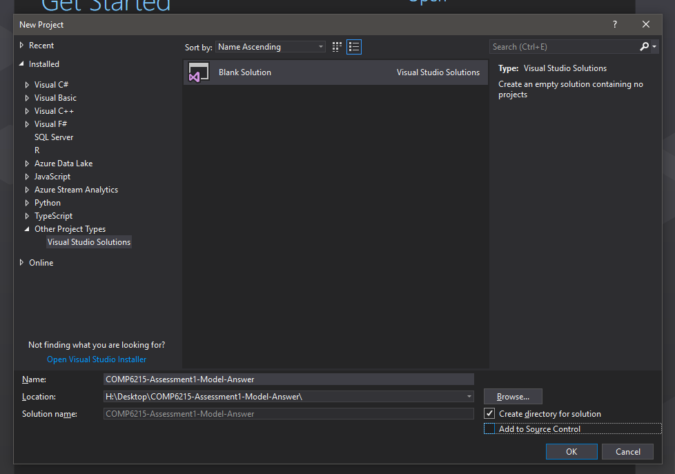

## 3. Setup the git stuff in Team Explorer

Team explorer is used to manage your version control and it does a number of things for you including creating your `.gitignore` file.

**Click on Settings**

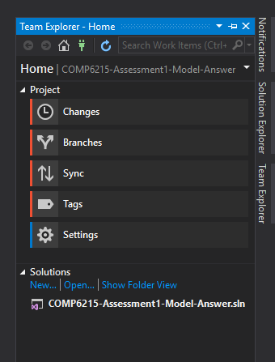

**Click on Repository Settings:**

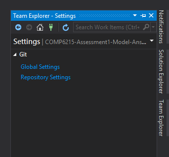

**Fill in the information**

1. Fill in your name and student email address

2. Add a ignore file

3. Add am Attributes file

4. You should see the remote link to your repository.

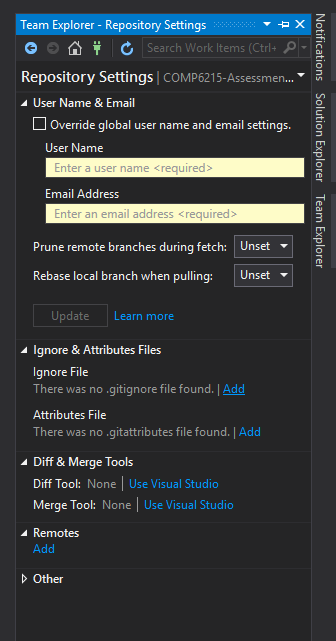

**It should look like something like this:**

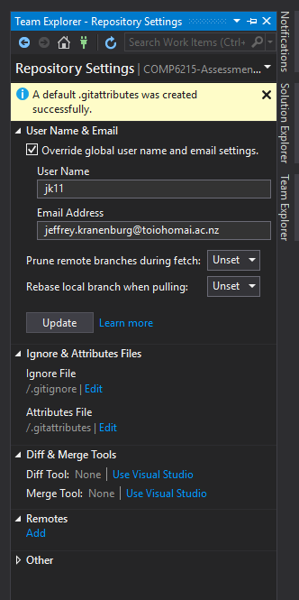

# Create the folder structure

Right click on the solution and create 3 folders

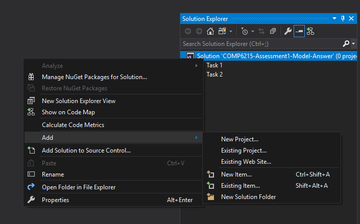

 Give the folders the following names:

* Task 1
* Task 2
* Task 3

Inside of each folder you need to create 3 projects:

* A Class Library Project
* A Console Application
* A WPF Application

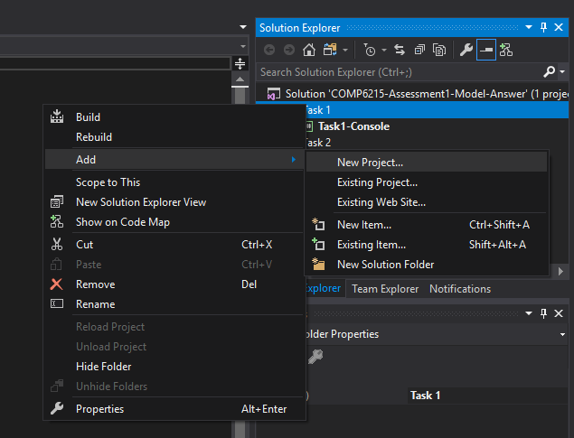

Then when you see this screen you can select the project type

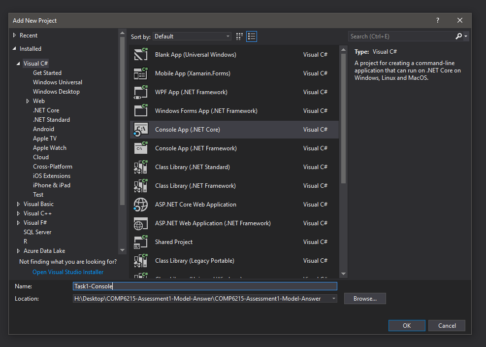

You must name them like this:

* Task-x-ClassLibrary
* Task-x-Console
* Task-x-WPF

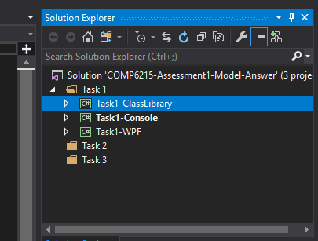

As the end result your project should look like this:

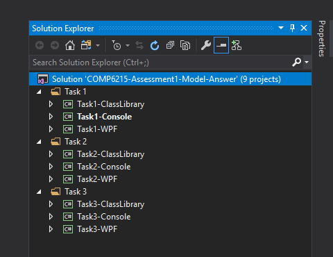

# Creating your first commit

In the team explorer click on changes and type in Initial commit in the box under "Branch: master"

Then click on the plus symbol next to changes and save any files if you haven't done so already.

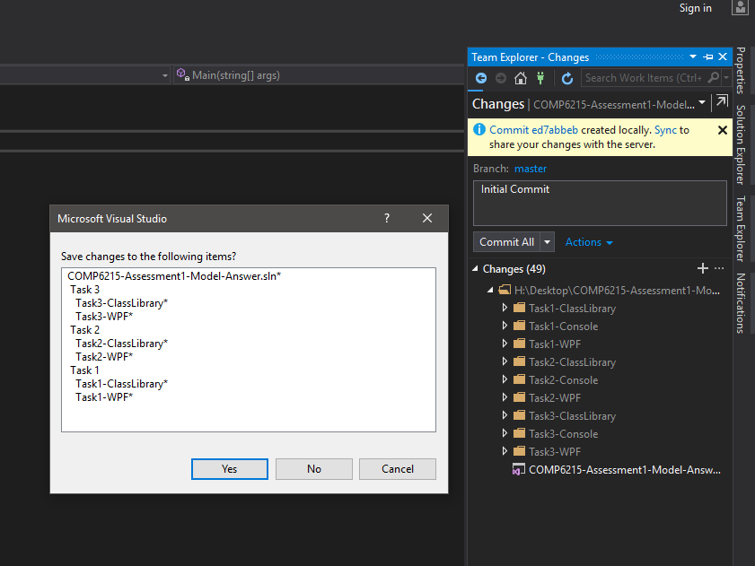

Click on the "Commit Staged" button 

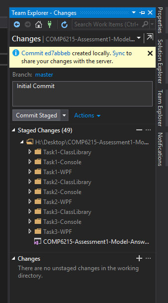

Once the files have been committed, the list should be empty.

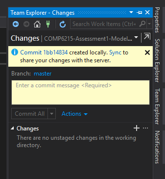

OPTIONAL: You can confirm that everything was commit by running the `git log` command in the terminal.

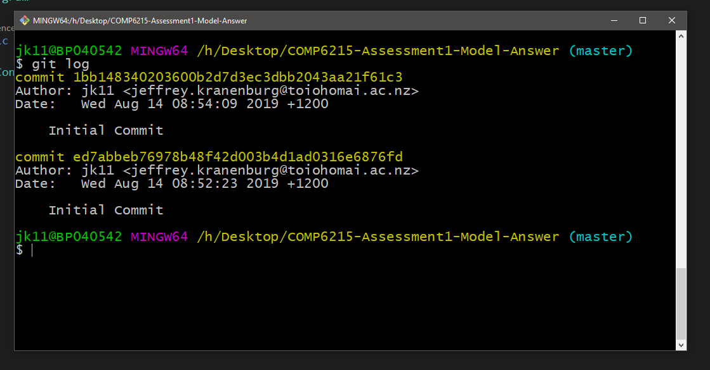

OPTIONAL: Also in the terminal, you can type in `git remote -v` to confirm that your repository is pointing to the right place. 

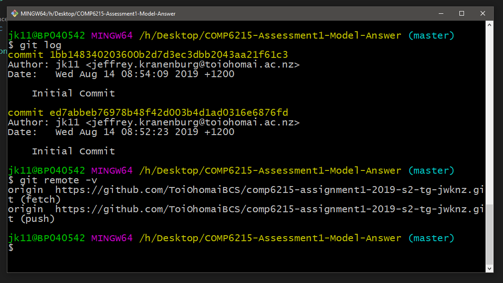

Once your files have been committed you need to push them to GitHub and for that you need to click on the **Sync** button

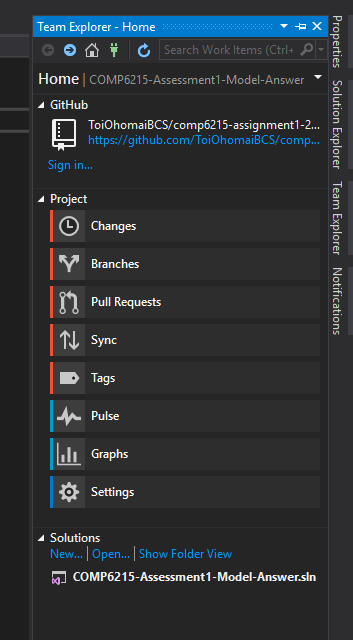

In the **Sync** Panel click on push under the Outgoing Commits header.

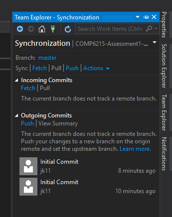

Type in your GitHub Credentials if the pop up comes up.

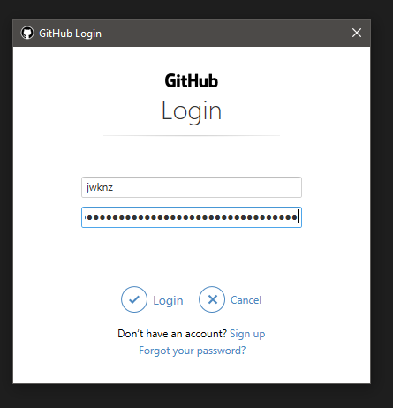

Once that is all completed you can view your project on GitHub like you normally do.

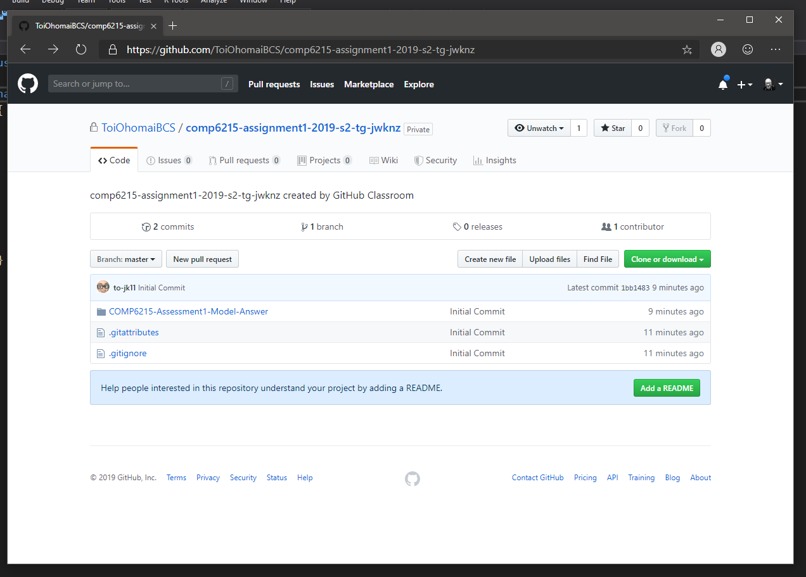

The folder structure would look like this:

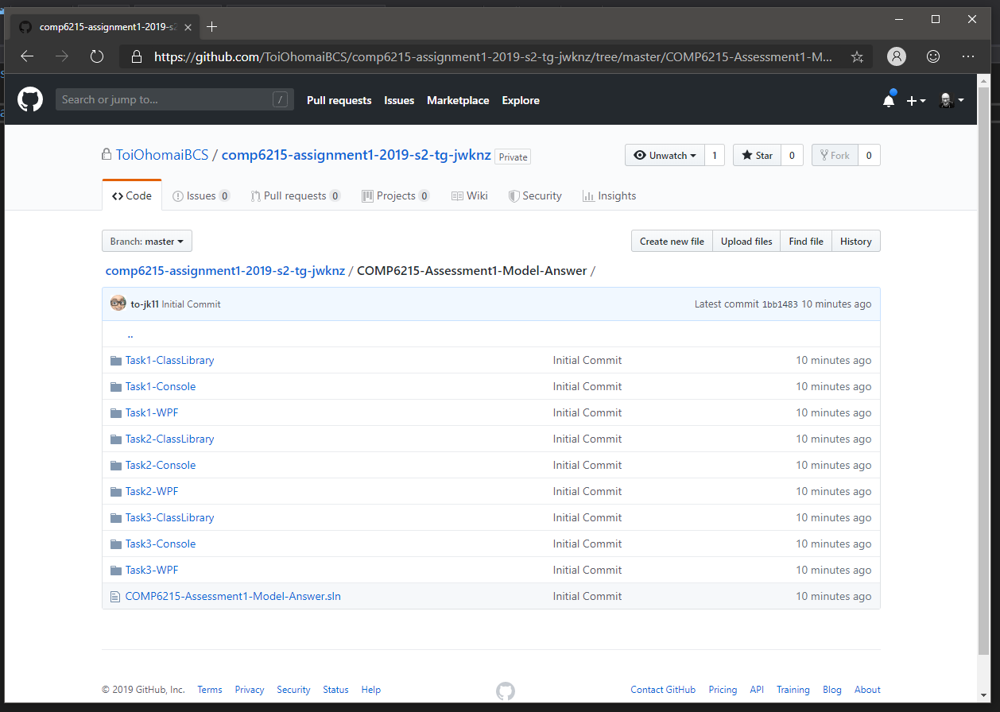

# Linking the Projects together

In Visual Studio under the Solution explorer you will need to add the class library projects to the Console and WPF projects, so you can share the code between them. 

**YOU MUST NOT LINK THE CONSOLE TO THE WPF PROJECT**

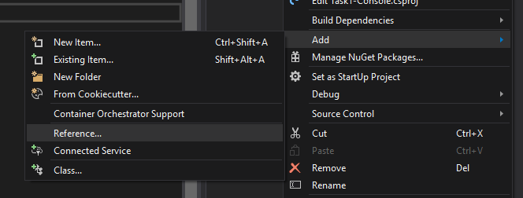

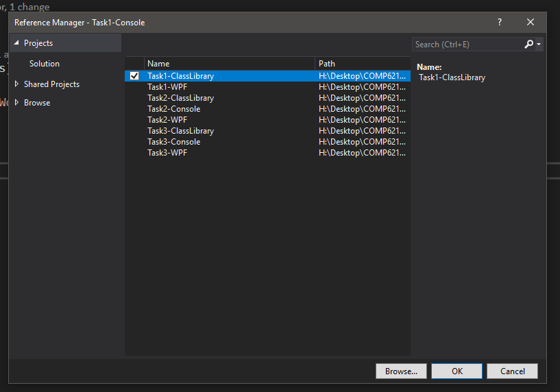

Once you have made all the links you go to the Team Explorer and under the changes tab, you should see this:

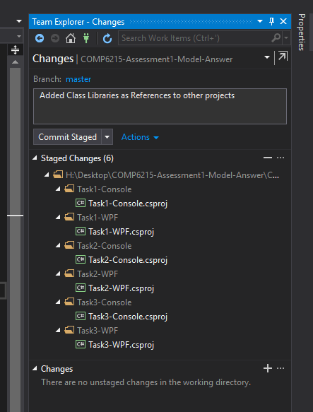

Next to a commit, like you did above and commit your changes then push your code up to GitHub.

This needs to be done regularly and it is strongly recommended that you do this at the end of each project at a minimum.

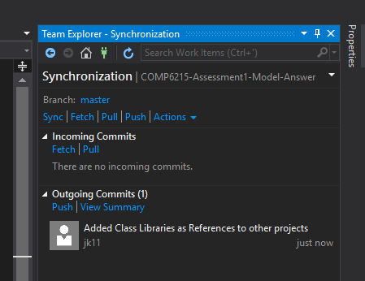

You can - and we (the teachers) can - double check this in the commits tab on GitHub.

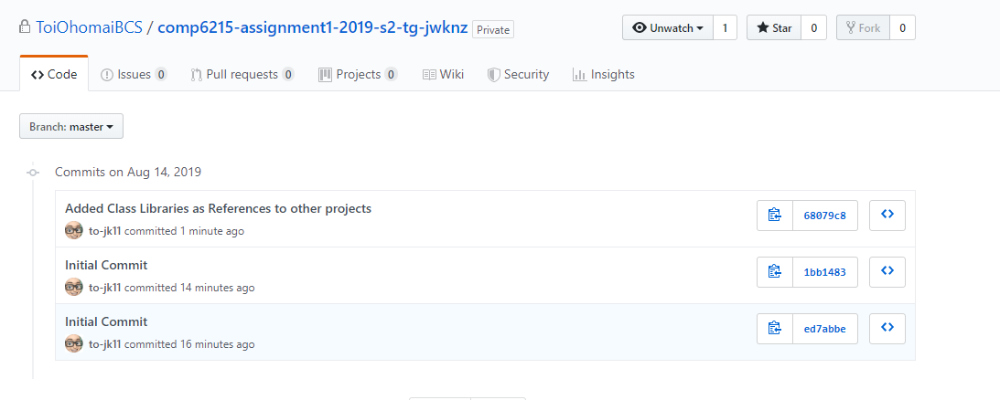

Have Fun!