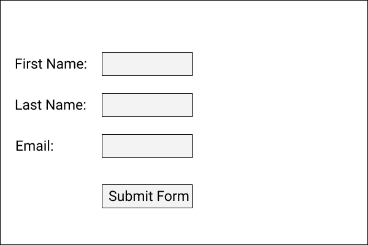

# Exercises

Use Visual Studio to create the following form using XAML and C#.  
The idea is for you to experiment with the languages and see what you can create.  

There are some key things to do when you are making this application.

* You should create a method that calls the `MessageBox.Show()` method and that method should take 3 parameters.

* When calling the method the UI parameters should be passed into the method.
* The method that is called by the event should call the `MessageBox.Show()` and pass in the string values that are received as parameters.
* The idea is to sepearate the UI from the Business logic as much as possible.

An example of the form is here:

