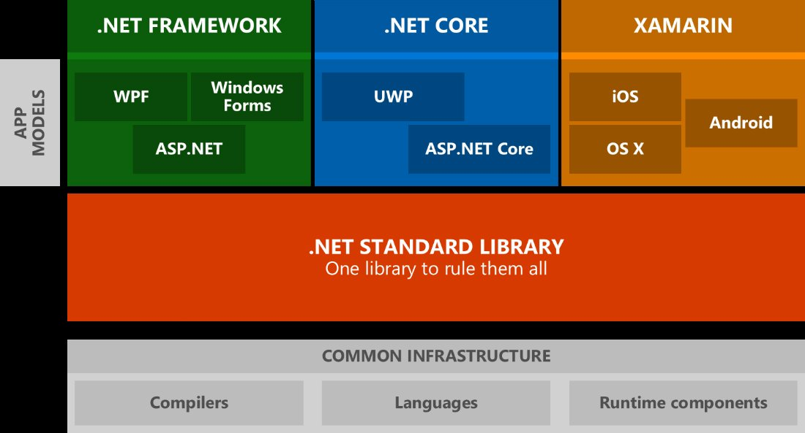
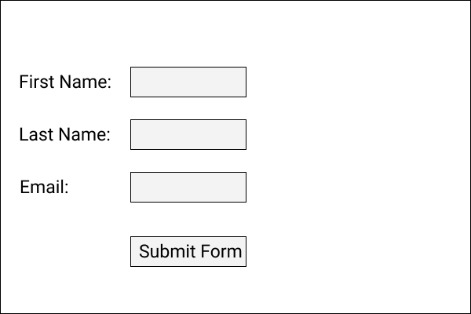

[](https://github.com/ToiOhomaiBCS/COMP6215-Course-Material/raw/master/week01/session01/readme.pdf)


# What is GUI Programming

GUI programming as the name implies is the programming of Graphical User Interfaces. GUI Objects are anything from buttons, lists, switches, labels and more.

Objects in GUI programming are just normal POCO classes (plain old clr objects - these are normal classes like you are used to.)

For example - Look at the documentation for a button [written in XAML](https://docs.microsoft.com/en-us/uwp/api/Windows.UI.Xaml.Controls.Button) and a button writen in [plain C# code](https://support.microsoft.com/en-us/help/319266/how-to-programmatically-add-controls-to-windows-forms-at-run-time-by-u)

We will come back to this a little later on.

The dotnet framework is big and consists of a lot of pieces - [although Microsoft is in the process of aligning that now with dotnet 5.0](https://devblogs.microsoft.com/dotnet/introducing-net-5/)

The image below shows you all of the dotnet areas that you can currently develop in.



[dotnet ecosystem](https://www.altexsoft.com/blog/engineering/the-good-and-the-bad-of-net-framework-programming/)

| Framework	| Description |
| :--- | :--- |
| Windows Forms and WPF	| These are used in desktop applications that are compatible with all of the Windows Operating systems |
| UWP	| Is used for applications of all sizes, all the way from the Hololens to Windows Phone (RIP, January 2019), Desktops, Laptops, the Surface Hubs and the Xbox interface. | 
| ASP.net	| Is the web framework that Microsoft has developed and uses C# in the backend. |
| Xamarin	| Allows you to create mobile apps for Android and iOS.|

# Lesson set up

In part 1 of the course (first 6 weeks) we will look at learning GUI objects and getting to know about the SOLID principles. You have a 2 classes per week and each week, the first class is setup for GUI programming and the second class is setup for covering the SOLID principle.

When using the SOLID Principles you will see that as we progress through each one that it makes sense to combine them. So as we learn each one, you will apply the ones we have already learned as well. The SP's are principles - not rules - but they are widely used in industry, so it will help to know about them. They are also not limited to C#. So try to apply these in other programming languages as well.

# PART 1: - Separating Code from the UI

When you are writing (good) software you need to write the code platform independent. This means that your "business logic" off the application should be able to fit in any GUI type project.

This week we are going to focus on making applications like that use this setup.

* Your classes should be UI free
* Your Methods outside of your Main Method should be UI free

The benefit of this is that you will be able to use the same code in multiple projects.

## POCO and DTO Classes

Earlier we spoke about a POCO class and how they are the type of classes you have used up until this point. We will keep using them, but we will also look at a DTO class later on in part 2 of the course.

1. A POCO (Plain old C# objects) class - This is a class like how you know it. Nothing fancy, but not has no persistant methods in there. i.e. It cannot grab data from a database or anything.
2. A DTO (Data Transfer objects) class - This is a class that does allows us to persist data. The structure of these classes are technically the same, but they are used for different things.

Up until this point you have worked with a **Program.cs** file and inside of that you have a class called `Program`.

In the `Program` class you will have written some methods that you can call from the `Main` method.  
You may have also created some other classes that hold properties and methods and applied the 4 pillars of OOP.
(encapsulation, inheritance, polymorphism and abstraction).

All these classes are still a POCO class and a POCO class consists of the following parts:

* Fields (these are the private variables of a class)
* Properties (these are the public accessors to the fields)
* Constructors (these are invoked as soon as the class is instantiated)
* Destructors (these run when an instance of a class is destroyed)
* Methods (functions of a class, these are things that of what a class can do)

We will make classes that contain all of the parts above, but also parts that may only use properties. Those are used to model data from a datasource like an api or a database.

## POCO classes in GUI Programming

There a couple of things to know about how the GUI works:

1. Whatever you code in GUI (c# dotnet) is converted into C# code first during compile time
2. Whatever you can drag onto a form, you can hard code
3. Whatever you drag a write in the editor first are static controls, you can only change them by wiriting C# or adding databinding to your code.

When you write the code for a button in XAML it may look like this:

```
<Button x:Name="btn" Content="Click Me!" Click="ShowAlertHandler" />
```

In C# code you will code something like this to get the same:

```
Button btn = new Button() 
{
  Content = "Click Me in Code!"
}

btn2.Click += ShowAlertHandler;

MainGrid.Children.Add(btn2); // MainGrid is the instance name of the parent object

```
In neither case do these objects themselves store any data and are therefore called POCO classes.

To design the interface we will use a Markup Language called XAML (eXtentisible Application Markup Language), but this language cannot change the interface dynamically - when the program is running - for that you will need to know or at least be familiar with their C# counterpart.

## Events and Methods

Each GUI interface design file has a file called a code-behind (CB) which is tightly coupled to what is displayed on the interface. You may have noticed that we could just type in `MainGrid` above without having to do anything special. This is because the UI and the CB file share the same class. You will notice that a class of a CB has the word "partial" in it.

The code block `ShowAlertHandler` that is triggered when we click on the button is called an event. You can recoginize an event easy by the fact that it has an `object` parameter and type of event as the second parameter.

Events are coded very much the same as a Method and in a way they are the same thing. An Event is something that does something, but more specific - and this is where it is different from a method - an event triggers an action that a user may responds to. A Method is something that stands alone from a UI object and is something that does things like a calculation or changes some code in some way. An Event does not change any code - it just triggers actions.

It is possible to write complex logic in an event, but **DO NOT DO THIS** it is not the purpose of an event and therefore that should be extracted from the event as much as possible.

If you have some logic that needs to be executed as part of a event then create a method to do so.

# Take Aways

Before you go start the exercises, let's recap the take aways from this class:

* GUI objects should be seperated from the Business Logic
* The dotnet framework is fairly fragmented at the moment, so you need to know which part you need to do a job.
* Every GUI Object can be written out in C# code as well
* POCO classes do not persist any data and stand on their own.
* Events only trigger actions


# Exercises

Use Visual Studio to create the following form using XAML and C#.  
The idea is for you to experiment with the languages and see what you can create.  

There are some key things to do when you are making this application.

* You should create a method that calls the `MessageBox.Show()` method and that method should take 3 parameters.

* When calling the method the UI parameters should be passed into the method.
* The method that is called by the event should call the `MessageBox.Show()` and pass in the string values that are received as parameters.
* The idea is to sepearate the UI from the Business logic as much as possible.

An example of the form is here:

