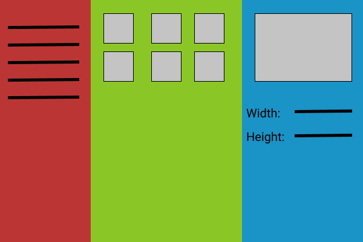

# Exercise

You are create an application that implements the following design:

You are to use the items discussed in class and research some of your own.

All of the programming skills you need are either in the notes of this class or things you have learned in previous classes.

Here are some tips and criteria:

### Column 1

This should hold a list of categories of items, for example: cars, fruit, vegetables, houses.

When you click on a category item, in the second column some images should appear that fit in that category.

### Column 2  

The images are to be 50 x 50 and when you click on an image the actual image should appear in the 3rd column.

An easy to set this up is to use a grid inside of a grid (nested grids)

### Column 3

This column should only appear when an image is selected from column 2 (you can use the auto value for your width for this).

For the Width and Height value you need to show the width and height of the original image.

The image in this column cannot be bigger than 300 pixels wide and should be the proper aspact ratio.