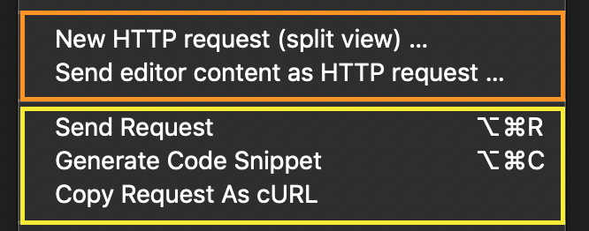

[](https://github.com/ToiOhomaiBCS/COMP6215-Course-Material/raw/master/week06/session01/readme.pdf)

# Exercise 1

Create, open and run the project

Create an MVC project and give it the name ASPMVC101 and then run it.

```bash
dotnet new mvc -o ASPWEB101 --no-https
```

Display the website in the browser, by running

```bash
dotnet run
```

and then you will need to navigate your browser to `http://localhost:5000/` to see the result.

# Exercise 2

Create, open and run the project

Create a WebAPI project and give it the name ASPWEB101 and then run it.

```bash
dotnet new webapi -o ASPWEB101 --no-https
```

Display the website in the browser, by running

```bash
dotnet run
```

and then you will need to navigate your browser to `http://localhost:5000/api/values` to see the result.

# Exercise 3

Install the extensions that were talked about in class and setup your first request using the boiler plate API.

* To do this, create a folder called HTTP (not required, but recommended)

* Inside of that folder create a file called `get.http` (File must end with http to get syntax highlighting)

* In the file type in:

```http
GET https://localhost:5001/api/values
```

* Run your project if you haven't done that already

* Right click in the `get.http` file and select `Send Request` - This will use the ReST Client extension you installed before.

And you should see:

```http
HTTP/1.1 200 OK
Connection: close
Date: Sun, 25 Aug 2019 23:01:16 GMT
Content-Type: application/json; charset=utf-8
Server: Kestrel
Transfer-Encoding: chunked

[
  "value1",
  "value2"
]
```

You should see both of these options in the context menu. 



* The **New HTTP request** gives you a more GUI friendly option to do the same thing.

# Exercise 4

Just like in Exercise 3, do the same thing, but add the the url to test into:

```http
GET https://localhost:5001/api/values/1
```

You will need to comment out the first line with a `#` symbol.
You should then see:

```http
HTTP/1.1 200 OK
Connection: close
Date: Sun, 25 Aug 2019 23:11:14 GMT
Content-Type: text/plain; charset=utf-8
Server: Kestrel
Transfer-Encoding: chunked

value
```