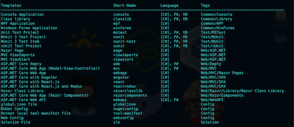
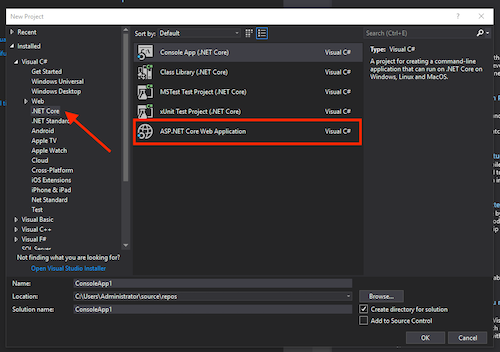
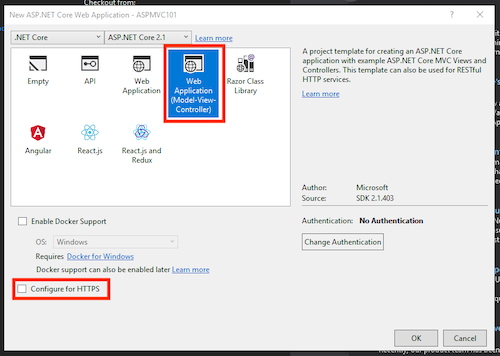
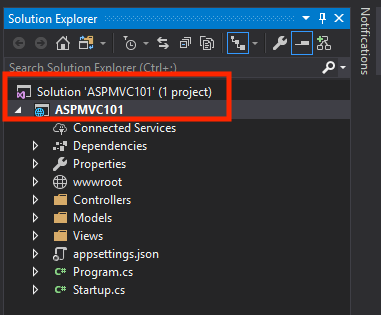
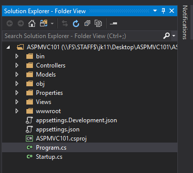

# Introduction to ASP.net Core

GUI Programming can be done in software, but also in the world of the web.

As you have looked at in previous classes, we can do GUI Programming using HTML, CSS and JavaScript and this is is no different in ASP.NET Core, but the backend (how you connect to and process data) is done in C# by using ASP.NET Core.

Using Visual Studio we can start an ASP.NET Core project using the GUI and when using Visual Studio Code we can start it using the dotnet cli.

This week we will look at how to use both.

# Part 1 - Introduction

ASP.NET Core is a cross-platform, high-performance, open-source framework for building modern, cloud-based, Internet-connected applications. With ASP.NET Core, you can:

* Build web apps and services, IoT apps, and mobile backends.
* Use your favorite development tools on Windows, macOS, and Linux.
* Deploy to the cloud or on-premises.
* Just like any other server-side language, ASP.NET is used to create dynamic website that process data in most cases comes from a database.

ASP.NET first came out as ASP (active server pages) in January 02, 2002 as part of the .Net framework launch.

ASP.NET at the time and right up until the Dotnet Core framework was launched in June 27, 2016 was part of the IIS system which was tied to Microsoft Server Operating system and came at a price tied to user licenses.

When ASP.NET Core was released it became free to use and you can now run websites using this framework on any Operating System natively.

Since then the system has grown greatly in speed and performance and for people who where already familiar with C#, this was a natural extension to tap into creating web services.

# Part 2 - Setting up an ASP.NET Core project

You can use dotnet core with vscode as well as the full Visual Studio IDE. We will look at how to install using both methods.

## Using Dotnet Core CLI

If you do not have the full Visual Studio installed, you will need to grab the dotnet-sdk from [dot.net](https://dotnet.microsoft.com/download). You can then access the CLI tools from either the terminal (on macos or linux) or the CMD / gitbash on Windows.

When you type in the command `dotnet new`. You will then see a list of all the options that you can download:

In some classes you may have used dotnet core to create console apps
 by using the command `dotnet new console`. Creating an ASP.NET app works very much the same, but there are more options.

 In this class we will have a look at 2 of them.

 | Short Name | Description |
 | :-- | :-- |
 | MVC | MVC is a design pattern, which you covered in COMP.6210 |
 | webapi | This is the main project we will work in, since we are going to create an api and connect it to a database |

 There are also some projects options that allow to set up a structure for bigger projects, but we can look at those if there is enough time.

 To create a new webapi project, simply type in the following:

 `dotnet new webapi -o project_name --no-https` where project_name should be a what you want to call your project.

 Once you have created the project you can open the project in the following way: 
 
 * to open it in vscode type in `code project_name` into the command line

 * to open it in visual studio, use the `file` > `open folder` method

## Using Visual Studio

Using the full Visual Studio IDE, you are presented with a window like this where you can select your project:

Next you can choose the template you want to use for your project

Note to disable the HTTPS options while you are doing the projects in the beginning since we are just doing local development.

In this class we will look at the **API** and **Web Application (Model-View-Controller)** options.

Finally name your application, select a location and then click on the "OK" button to create your application.

## Solution Explorer

Both Visual Studio and Visual Studio Code can work with folder based projects and solution based projects.

Visual Studio by default will create a solution file and add your project into that. 

The Dotnet CLI will not. 

This is because Visual Studio Code works on a folder based approach and solutions are not required to run the project.

As far as the applications operation, the outcome is the same.

### Solution Based Option

### Folder Based Option

* Introduction to ASP.net Core
* Dotnet Core Option / Visual Studio Option
* HTML / CSS (Placing of files)
* Development vs Production